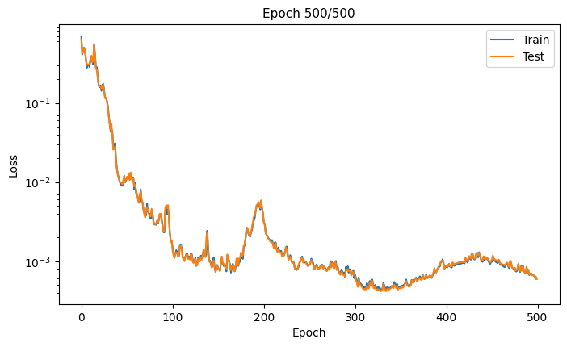
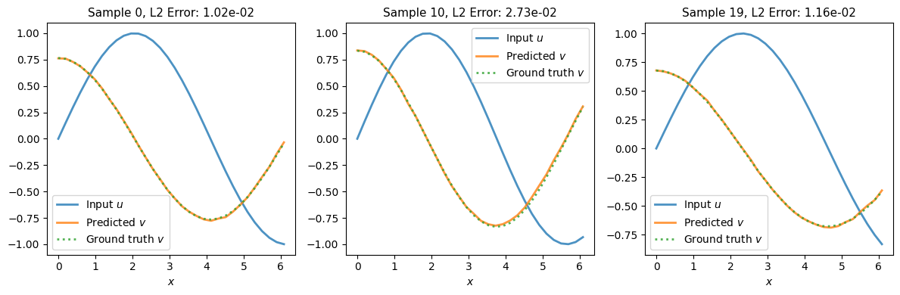

# Learning an antiderivative operator

This tutorial demonstrates how to train a Fourier neural operator (FNO) 
to learn an antiderivative operator.

## Problem statement

We'll train an FNO to learn the mapping $G : u \rightarrow v$, where
$$ v(x) = \frac{du}{dx} $$
for
$$ u(x) = \sin(\alpha x), \quad x \in [0, 2\pi], \quad \alpha \in [0.5, 1] $$
and where $u$, $v$ have periodic boundary conditions.

## Spatial discretisation

A uniform finite difference discretisation of the domain 
leads to grid points
$$ x_i = i h, \quad i = 0, \ldots, n-1 $$
where the grid spacing $h = L / n$ and $n$ is the number of 
grid points. The periodic boundary conditions imply that $x_0$ = $x_n$.

## Implementation

### Data generation

Create synthetic training data:

```python
import jax
import jax.numpy as jnp

key = jax.random.key(0)

# Configuration
resolution = 32
n_samples = 120
n_train = 100
n_test = 20

# Domain
L = 2 * jnp.pi
h = L / resolution
grid = jnp.linspace(0, L - h, resolution)

# Generate u and v
alpha = 0.5 * (1 + jax.random.uniform(key, (n_samples,)))
u_data = [jnp.sin(alpha[i] * grid) for i in range(n_samples)]
v_data = [alpha[i] * jnp.cos(alpha[i] * grid) for i in range(n_samples)]

# Stack into tensors
x_coords = jnp.tile(grid, (n_samples, 1))
u = jnp.stack(u_data)
v = jnp.stack(v_data)

# Create input with shape (batch, features, grid)
# Input features: [u(x), x]
input_data = jnp.stack([u, x_coords], axis=-1)
input_data = jnp.permute_dims(input_data, (0, 2, 1))

# Output with shape (batch, features, grid)
output_data = v[:, None, :]

# Split into train and test sets
train_ds = {
    'input': input_data[:n_train], 
    'output': output_data[:n_train]
}
test_ds = {
    'input': input_data[-n_test:], 
    'output': output_data[-n_test:]
}
```

Create an iterator for batching the data:

```python
from typing import Dict

class DatasetIterator:
    def __init__(
        self, 
        dataset: Dict[str, jnp.ndarray], 
        batch_size: int, 
        shuffle: bool = True
    ):
        self.dataset = dataset
        self.batch_size = batch_size
        self.shuffle = shuffle
        self.n_samples = dataset['input'].shape[0]
        self.reset()
    
    def reset(self, key=jax.random.key(0)):
        """Reset iterator with optional reshuffling"""
        self.indices = jnp.arange(self.n_samples)
        if self.shuffle:
            self.indices = jax.random.permutation(key, self.indices)
        self.current_idx = 0
    
    def __iter__(self):
        return self
    
    def __next__(self) -> Dict[str, jnp.ndarray]:
        if self.current_idx >= self.n_samples:
            raise StopIteration
        
        start_idx = self.current_idx
        end_idx = min(start_idx + self.batch_size, self.n_samples)
        batch_indices = self.indices[start_idx:end_idx]
        
        batch = {
            'input': self.dataset['input'][batch_indices],
            'output': self.dataset['output'][batch_indices]
        }
        
        self.current_idx = end_idx
        return batch
    
    def __len__(self):
        return (self.n_samples + self.batch_size - 1) // self.batch_size
```

### Model creation

Create an FNO1D model instance:

```python
from flax import nnx
import jax_fno

model = jax_fno.FNO1D(
    key,
    input_dim=2,            # [u(x), x]
    output_dim=1,           # [v(x)]
    width=64,               # Hidden dimension
    n_modes=12,             # Number of learnable Fourier modes
    n_layers=4,             # Number of Fourier layers
    projection_hidden=128,  # Hidden size in projection layer
)

# Print model structure
nnx.display(model)
```

Verify forward pass works:

```python
x = train_ds['input'][:2]
y = model(x)
print(f"Input shape: {x.shape}")
print(f"Output shape: {y.shape}")
```

### Training

Create an optax optimiser with an exponentially decaying learning rate:

```python
import optax

# Learning rate schedule
learning_rate = 1e-3
batch_size = 16
steps_per_epoch = (n_train + batch_size - 1) // batch_size

schedule = optax.schedules.exponential_decay(
    learning_rate,
    transition_steps=steps_per_epoch * 100,  # Decay every 100 epochs
    decay_rate=0.5,
    staircase=True
)

optimizer = nnx.Optimizer(model, optax.adam(schedule), wrt=nnx.Param)
metrics = nnx.MultiMetric(loss=nnx.metrics.Average('loss'))
```

Define loss and training functions:

```python
def l2_loss(pred, target, eps=1e-6):
    """Relative L2 loss"""
    numerator = jnp.sum((pred - target)**2, axis=-1)
    denominator = jnp.sum(target**2, axis=-1) + eps
    return jnp.mean(numerator / denominator)

def loss_fn(model, inputs, targets):
    predictions = model(inputs)
    return l2_loss(predictions, targets)

@nnx.jit
def train_step(model, optimizer, metrics, inputs, targets):
    grad_fn = nnx.value_and_grad(loss_fn)
    loss, grads = grad_fn(model, inputs, targets)
    metrics.update(loss=loss)
    optimizer.update(model, grads)

@nnx.jit
def eval_step(model, metrics, inputs, targets):
    loss = loss_fn(model, inputs, targets)
    metrics.update(loss=loss)
```

Train the model:

```python
import matplotlib.pyplot as plt
from IPython.display import clear_output

n_epochs = 500
metrics_history = {'train_loss': [], 'test_loss': []}

train_iter = DatasetIterator(train_ds, batch_size=batch_size)
test_iter = DatasetIterator(
    test_ds, batch_size=batch_size, shuffle=False
)

shuffle_key = jax.random.key(0)

for epoch in range(1, n_epochs + 1):
    # Training
    model.train()
    for batch in train_iter:
        train_step(model, optimizer, metrics, batch['input'], batch['output'])
    
    shuffle_key, subkey = jax.random.split(shuffle_key)
    train_iter.reset(subkey)
    metrics_history['train_loss'].append(metrics.compute()["loss"])
    
    # Evaluation
    model.eval()
    for batch in test_iter:
        eval_step(model, metrics, batch["input"], batch["output"])
    
    test_iter.reset()
    metrics_history["test_loss"].append(metrics.compute()["loss"])
    metrics.reset()
    
    # Plot progress
    if epoch % 10 == 0:
        clear_output(wait=True)
        fig, ax = plt.subplots(figsize=(8, 4.5))
        ax.set_xlabel('Epoch', fontsize=10)
        ax.set_ylabel('Loss', fontsize=10)
        ax.set_yscale('log')
        ax.plot(metrics_history['train_loss'], label='Train')
        ax.plot(metrics_history['test_loss'], label='Test')
        ax.legend()
        ax.set_title(f'Epoch {epoch}/{n_epochs}', fontsize=11)
        plt.show()
```



### Evaluation

Make predictions on test set:

```python
model.eval()

n_examples = 3
n_test = test_ds['input'].shape[0]
example_indices = jnp.array([0, n_test//2, n_test-1])

selected_inputs = test_ds['input'][example_indices]
selected_outputs = test_ds['output'][example_indices]
predictions = model(selected_inputs)

# Visualise results
fig, axes = plt.subplots(1, n_examples, figsize=(12, 4), layout='tight')

for i, (ax, idx) in enumerate(zip(axes, example_indices)):
    x = selected_inputs[i, 1, :]
    u0 = selected_inputs[i, 0, :]
    v_true = selected_outputs[i, 0, :]
    v_pred = predictions[i, 0, :]

    # Plot
    ax.plot(x, u0, '-', label='Input $u$', linewidth=2, alpha=0.8)
    ax.plot(x, v_pred, '-', label='Predicted $v$', linewidth=2, alpha=0.8)
    ax.plot(x, v_true, ':', label='Ground truth $v$', linewidth=2, alpha=0.8)

    # Error
    l2_error = jnp.linalg.norm(v_pred - v_true) / jnp.linalg.norm(v_true)
    ax.set_title(f'Sample {idx}, L2 Error: {l2_error:.2e}', fontsize=11)
    ax.set_xlabel('$x$', fontsize=10)
    ax.legend(fontsize=10)

plt.show()
```

